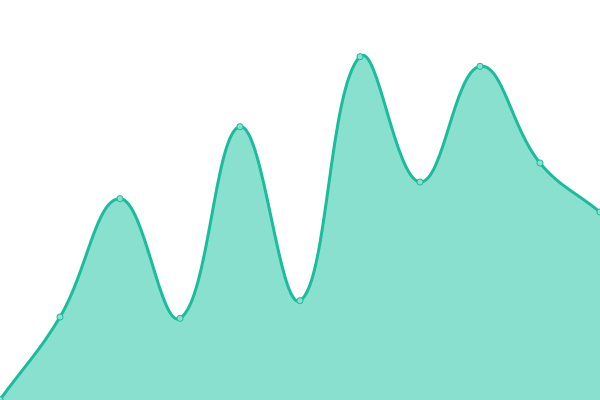

# [📈 Live Status](https://status.weiensong.top): <!--live status--> **🟩 All systems operational**

This repository contains the open-source uptime monitor and status page for [Ensong Wei ](https://hi.weiensong.top/), powered by [Upptime](https://github.com/upptime/upptime).

With [Upptime](https://upptime.js.org), you can get your own unlimited and free uptime monitor and status page, powered entirely by a GitHub repository. We use [Issues](https://github.com/touero/upptime/issues) as incident reports, [Actions](https://github.com/touero/upptime/actions) as uptime monitors, and [Pages](https://status.weiensong.top) for the status page.

<!--start: status pages-->
<!-- This summary is generated by Upptime (https://github.com/upptime/upptime) -->
<!-- Do not edit this manually, your changes will be overwritten -->
<!-- prettier-ignore -->
| URL | Status | History | Response Time | Uptime |
| --- | ------ | ------- | ------------- | ------ |
|  [weiensong](https://hi.weiensong.top) | 🟩 Up | [weiensong.yml](https://github.com/touero/upptime/commits/HEAD/history/weiensong.yml) | 

 119ms
     
 | 

<a href="https://status.weiensong.top/history/weiensong">100.00%</a>
    

|  [tdl](https://downloads.weiensong.top) | 🟩 Up | [tdl.yml](https://github.com/touero/upptime/commits/HEAD/history/tdl.yml) | 

 159ms
     
 | 

<a href="https://status.weiensong.top/history/tdl">98.52%</a>
    

|  [ofdviewer](https://ofdviewer.weiensong.de5.net/) | 🟩 Up | [ofdviewer.yml](https://github.com/touero/upptime/commits/HEAD/history/ofdviewer.yml) | 

 657ms
     
 | 

<a href="https://status.weiensong.top/history/ofdviewer">100.00%</a>
    

|  [piczip](https://piczip.weiensong.de5.net/) | 🟩 Up | [piczip.yml](https://github.com/touero/upptime/commits/HEAD/history/piczip.yml) | 

 705ms
     
 | 

<a href="https://status.weiensong.top/history/piczip">99.61%</a>
    

|  [scelcov](https://scelcov.bingzgoj.cc.cd) | 🟩 Up | [scelcov.yml](https://github.com/touero/upptime/commits/HEAD/history/scelcov.yml) | 

 446ms
     
 | 

<a href="https://status.weiensong.top/history/scelcov">100.00%</a>
    

<!--end: status pages-->

[**Visit our status website →**](https://status.weiensong.top)

## 📄 License

- Powered by: [Upptime](https://github.com/upptime/upptime)
- Code: [MIT](./LICENSE) © [Anand Chowdhary](https://anandchowdhary.com), supported by [Pabio](https://pabio.com)
- Data in the `./history` directory: [Open Database License](https://opendatacommons.org/licenses/odbl/1-0/)
